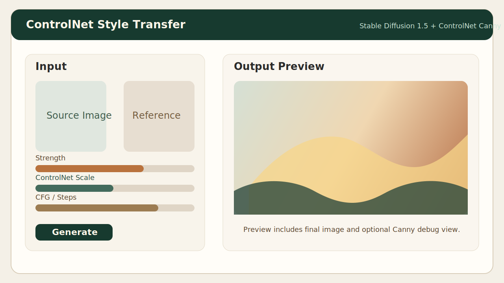
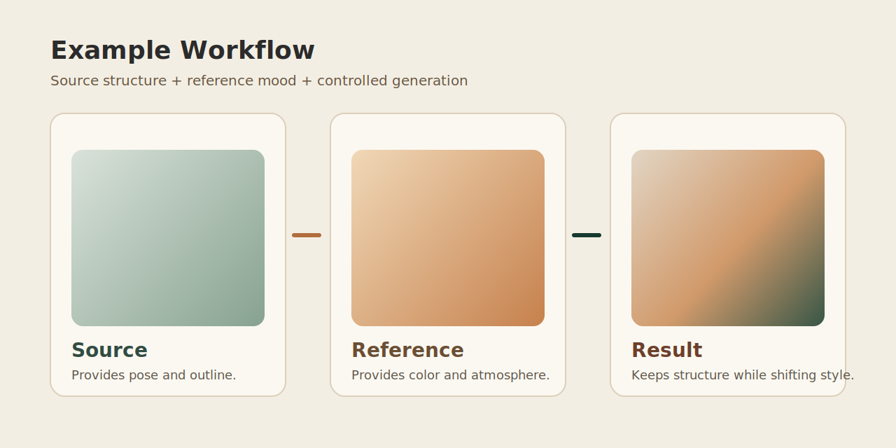

# ControlNet Style Transfer

[English README](README_EN.md)

基于 `Stable Diffusion 1.5 + ControlNet (Canny)` 的图像风格迁移小工具。它保留源图的结构信息，再结合参考图的色彩和整体氛围，生成更可控的风格化结果。

推荐使用 `Python 3.10` 或 `3.11`。本项目在当前机器上已验证可以进入模型下载阶段，但 `3.13/3.14` 更适合临时兼容测试，不建议作为首选发布环境。


## 功能概览

- 使用 ControlNet Canny 约束结构，减少“抽卡式”失控生成。
- 支持源图、参考图、提示词共同控制结果。
- 自动进行基础色彩匹配，让结果更接近参考图氛围。
- 本地优先加载模型，兼顾离线启动与首次联网下载。
- 提供 Gradio Web UI，适合快速实验和演示。
- 自动保存结果到 `outputs/`，避免手动导出遗漏。

## 项目结构

```text
ControlNet-Style-Transfer/
├─ app.py
├─ main.py
├─ LICENSE
├─ README.md
├─ requirements.txt
├─ CHANGELOG.md
├─ ROADMAP.md
├─ config/
│  └─ settings.py
├─ docs/
│  └─ assets/
│     ├─ ui-preview.svg
│     └─ example-gallery.svg
└─ src/
   ├─ __init__.py
   ├─ image_utils.py
   ├─ model_loader.py
   ├─ pipeline.py
   └─ ui.py
```

## 安装步骤

### 1. 克隆仓库

```bash
git clone https://github.com/your-name/ControlNet-Style-Transfer.git
cd ControlNet-Style-Transfer
```

### 2. 创建虚拟环境

Windows PowerShell:

```powershell
python -m venv .venv
.venv\Scripts\Activate.ps1
```

macOS / Linux:

```bash
python -m venv .venv
source .venv/bin/activate
```

### 3. 安装依赖

CPU 环境：

```bash
pip install -r requirements.txt
```

NVIDIA CUDA 环境：

```bash
pip install -r requirements.txt --extra-index-url https://download.pytorch.org/whl/cu121
```

如果你已经按官方方式单独装过 `torch` 和 `torchvision`，也可以继续直接执行：

```bash
pip install -r requirements.txt --no-deps
```

### 4. 首次运行

```bash
python main.py
```

默认启动地址：

```text
http://127.0.0.1:7860
```

首次运行会下载：

- 基础模型 `SG161222/Realistic_Vision_V6.0_B1_noVAE`
- ControlNet `lllyasviel/sd-controlnet-canny`

## 使用说明

1. 上传一张源图片，作为结构参考。
2. 上传一张参考图片，提供色彩和风格倾向。
3. 选填 prompt，补充你想保留或增强的内容。
4. 调整 `Strength / ControlNet Scale / CFG / Steps`。
5. 点击生成，结果会显示在右侧，同时自动保存到 `outputs/`。

## 运行截图 / 示例图

当前仓库内先放了可直接展示的示意图，方便 README 展示和项目介绍。后续你跑出满意结果后，可以直接替换成真实截图。

### UI 预览



### 示例流程



## 默认参数说明

- `Strength`: 风格迁移强度。越高越偏向新生成内容。
- `ControlNet Scale`: 结构约束强度。越高越贴近源图边缘结构。
- `CFG`: 提示词引导强度。越高越贴近 prompt，但过高可能不自然。
- `Steps`: 推理步数。通常 `20-40` 是性价比较高的区间。

## 当前版本改进点

`v0.1.0` 相比最初版本，补了几处关键稳定性问题：

- 统一把输入图片标准化为 RGB，避免灰度图和 RGBA 图直接报错。
- 修复极端长宽比下缩放可能得到 `0` 宽高的问题。
- 输出文件名增加唯一后缀，减少重复生成时覆盖文件的风险。
- 将 `ControlNet Scale / CFG / Steps` 暴露到 UI，方便调参。
- 补齐 `LICENSE`、安装说明、发布说明、roadmap 和 README 资源图。

## 已知限制

- 目前仍依赖 prompt 和参考图，结果存在一定随机性。
- “风格提取”还是轻量启发式实现，不是单独训练的 style encoder。
- 首次下载模型需要稳定网络和较大磁盘空间。
- 没有接入批处理、队列调度和自动评测。

## 发布说明

- 当前版本：`v0.1.0`
- 详细变更见 [CHANGELOG.md](CHANGELOG.md)
- 发布说明见 [docs/releases/v0.1.0.md](docs/releases/v0.1.0.md)
- 后续规划见 [ROADMAP.md](ROADMAP.md)

## License

本项目采用 [MIT License](LICENSE)。
